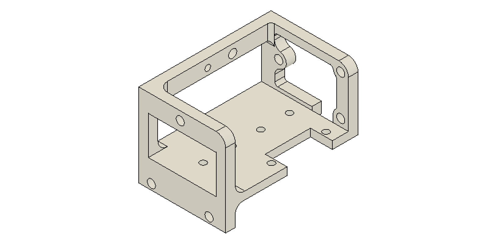
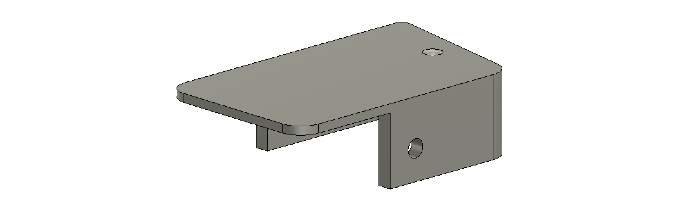

:github_url: https://github.com/Karpova-Lab/nosepoke

Building
--------
.. image:: images/parts.jpg
  :align: center

Components
++++++++++
  
Hardware
========
+-----+--------------------------+------------------------------------------------------------------------------------------------------+---------------+
| QTY | Description              | Part Number                                                                                          | Supplier      | 
+=====+==========================+======================================================================================================+===============+
| 2   | Press-fit spring plunger | `8683A11 <https://www.mcmaster.com/8683a11>`_                                                        | McMaster-Carr | 
+-----+--------------------------+------------------------------------------------------------------------------------------------------+---------------+
| 7   | M3 threaded insert       | `94510A240 <https://www.mcmaster.com/#94510A240>`_                                                   | McMaster-Carr | 
+-----+--------------------------+------------------------------------------------------------------------------------------------------+---------------+
| 4   | M3 x 8mm pan head screws | `92000A118 <https://www.mcmaster.com/92000a118>`_                                                    | McMaster-Carr | 
+-----+--------------------------+------------------------------------------------------------------------------------------------------+---------------+
| 3   | M3 x 8mm flat head screws| `91801A154 <https://www.mcmaster.com/91801A154>`_                                                    | McMaster-Carr | 
+-----+--------------------------+------------------------------------------------------------------------------------------------------+---------------+
| 4   | M2 threaded insert       | `94510A360 <https://www.mcmaster.com/94510a360>`_                                                    | McMaster-Carr | 
+-----+--------------------------+------------------------------------------------------------------------------------------------------+---------------+
| 5   | M2 x 5 mm screws         | `92000A012 <https://www.mcmaster.com/92000a012>`_                                                    | McMaster-Carr | 
+-----+--------------------------+------------------------------------------------------------------------------------------------------+---------------+
| 1   | Servo                    | `35065S00 <https://www.servocity.com/hs-5065mg>`_                                                    | ServoCity     | 
+-----+--------------------------+------------------------------------------------------------------------------------------------------+---------------+
| 1   | Servo arm                | `55707 <https://www.servocity.com/55707-mini-aluminum-single-arm>`_                                  | ServoCity     | 
+-----+--------------------------+------------------------------------------------------------------------------------------------------+---------------+
| 1   | Limit switch             | `D2HW-C203MR <https://www.digikey.com/products/en?keywords=SW1154-ND>`_                              | Digi-Key      | 
+-----+--------------------------+------------------------------------------------------------------------------------------------------+---------------+
| 1   | 55mm linear rail         | `MGNR5R55HM <https://motioncontrolsystems.hiwin.com/item/mg-series-rail/mg-series-rail/mgnr5r55hm>`_ | HIWIN         | 
+-----+--------------------------+------------------------------------------------------------------------------------------------------+---------------+
| 1   | 5mm block                | `MGN5CZFH <https://motioncontrolsystems.hiwin.com/item/mg-series-block/mg-series-block/mgn5czfh>`_   | HIWIN         | 
+-----+--------------------------+------------------------------------------------------------------------------------------------------+---------------+

Frame
=====

- Download :download:`frame.stl <../_static/frame.stl>` 

Carriage
========
.. image:: images/carriage.png

- Download :download:`carriage.stl <../_static/carriage.stl>` 

Lever
=====

- Download :download:`lever.stl <../_static/lever.stl>` 
- Download :download:`lever.step <../_static/lever.step>` 

Front Plate
===========

- Download :download:`front_plate.dxf <../_static/front_plate.dxf>` 

PCBs and Electronics
====================
PCB source files are on `GitHub <https://github.com/Karpova-Lab/Lever/tree/main/pcb>`_ 

.. image:: images/pcb_render.png
  :width: 60%

.. raw:: html

  <a href="https://oshpark.com/shared_projects/nfp2wGL1">
    </img>
  </a>

+-----+-----------+----------------+--------------------------------------------------------------------------------------+
| Qty | Reference | Description    | Value/MPN                                                                            | 
+=====+===========+================+======================================================================================+
| 1   | C1        | 0603 Capacitor | `0.1 µF <https://www.digikey.com/products/en?keywords=1276-1258-1-ND>`_              | 
+-----+-----------+----------------+--------------------------------------------------------------------------------------+
| 1   | C2        | Capacitor      | `470 µF <https://www.digikey.com/products/en?keywords=P15094CT-ND>`_                 | 
+-----+-----------+----------------+--------------------------------------------------------------------------------------+
| 1   | D1        | Indicator LED  | `Red <https://www.digikey.com/products/en?keywords=160-1447-1-ND>`_                  | 
+-----+-----------+----------------+--------------------------------------------------------------------------------------+
| 1   | J1        | RJ45 Jack      | `0855135013 <https://www.digikey.com/products/en?keywords=WM3553CT-ND>`_             | 
+-----+-----------+----------------+--------------------------------------------------------------------------------------+
| 1   | R1        | 0603 Resistor  | `20KΩ <~>`_                                                                          | 
+-----+-----------+----------------+--------------------------------------------------------------------------------------+
| 1   | U1        | ATtiny 24 MCU  | `ATTINY24A-SSUR <https://www.digikey.com/products/en?keywords=ATTINY24A-SSURCT-ND>`_ | 
+-----+-----------+----------------+--------------------------------------------------------------------------------------+
| 1   | X1        | ISP Header     | `75869-331LF <https://www.digikey.com/products/en?keywords=609-5122-ND>`_            | 
+-----+-----------+----------------+--------------------------------------------------------------------------------------+

.. raw:: html

  

    <a href="../_static/ibom.html" style="background-color: #2980b9;
    border: none;
    color: white;
    padding: 15px 15px;
    text-align:center;
    text-decoration: none;
    display: inline-block;
    font-size: 18px;
    border-radius:15px">View interactive BOM</a>
  

Assembly
++++++++

Required Tools
==============
- 2mm hex key or  `screwdriver <https://www.mcmaster.com/57585a53>`_ 
- Soldering iron 

Instructions
============

#. 