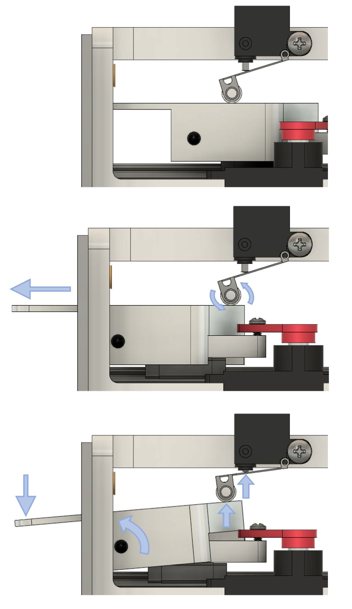

# Overview

    <a href="https://a360.co/2xeP6Bi">
        
        </img>
    </a>



This is the documentation for building and using a retractable lever.
This project was developed in the [Karpova Lab](https://www.janelia.org/lab/karpova-lab) at HHMI's Janelia Research Campus for use in rodent behavioral experiments.

## Features

- Extends and retracts depending on input signal
- Outputs signal when lever is pressed or released
- [pyControl](https://pycontrol.readthedocs.io/en/latest/user-guide/hardware/#behaviour-ports) compatible
- Durable - faceplate and lever are made of aluminum
- Fast - 180ms to extend or retract
- Open - all files are available on [GitHub](https://github.com/Karpova-Lab/nosepoke)  and can be modified to meet custom needs





<!-- 
 

 

 

<--->

 -->



    
     
    
     
    

<--->



