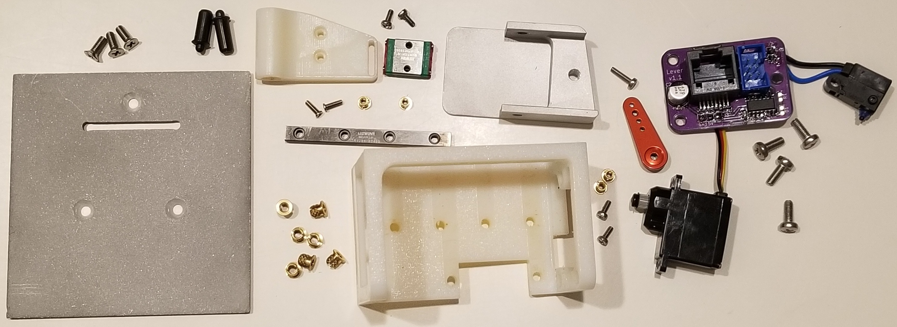
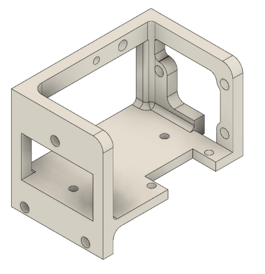
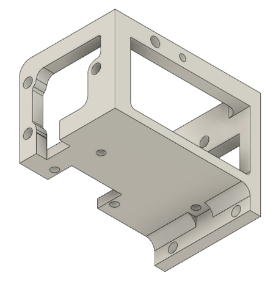
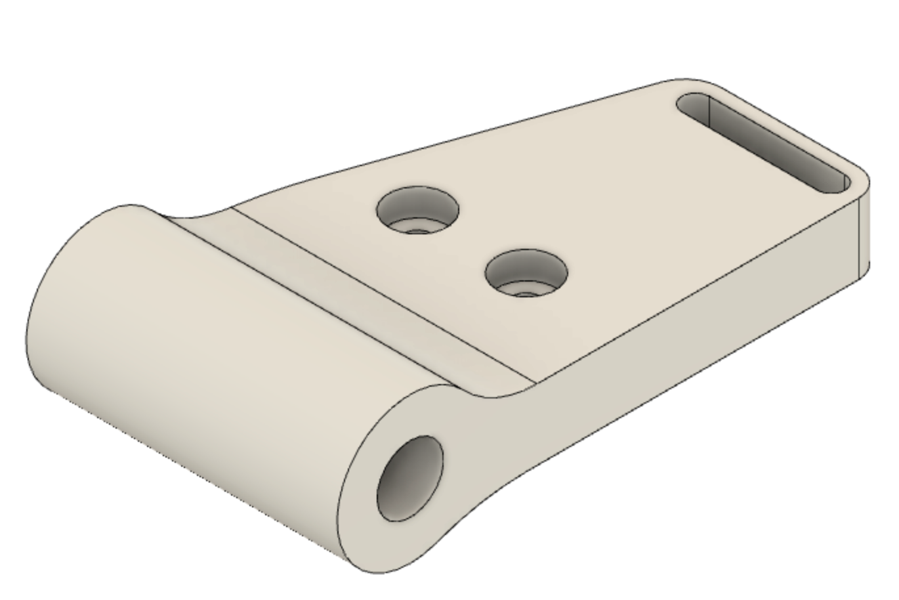
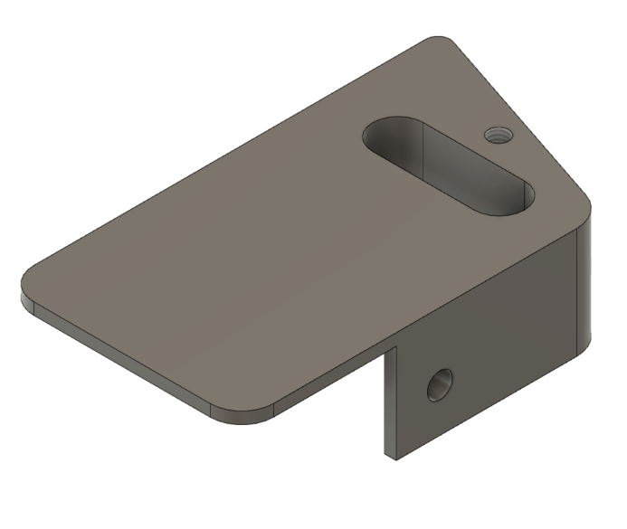
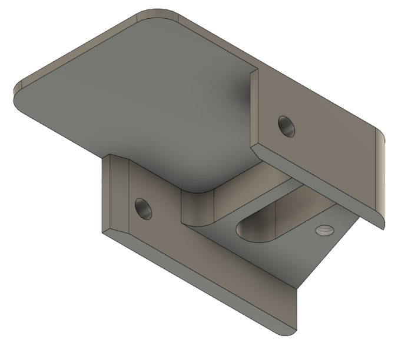
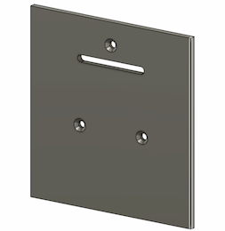
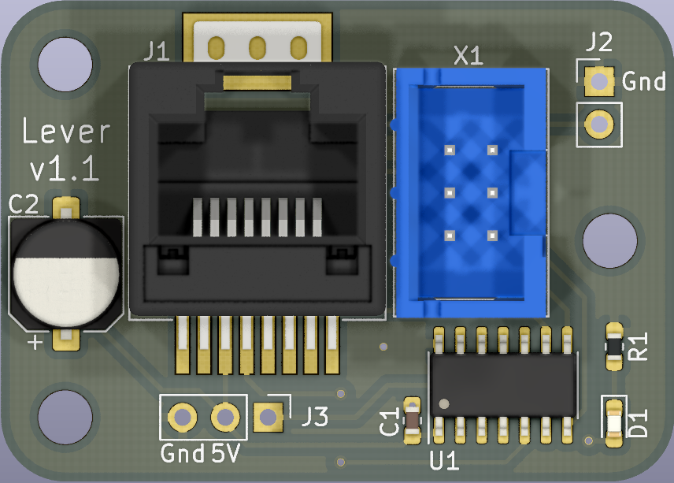

# Building

## Hardware

| QTY | Description                | Part Number                                                                                                                                       | Supplier      | 
|-----|----------------------------|---------------------------------------------------------------------------------------------------------------------------------------------------|---------------|
| 2   | Press-fit spring plunger   | [8683A11](https://www.mcmaster.com/8683a11)                                                                                                       | McMaster-Carr | 
| 7   | M3 threaded insert         | [94510A240](https://www.mcmaster.com/94510A240/)                                                                                                  | McMaster-Carr | 
| 3   | M3 x 8 mm flat head screws | [92010A118](https://www.mcmaster.com/92010A118/)                                                                                                  | McMaster-Carr | 
| 4   | M3 x 8 mm pan head screws  | [92000A118](https://www.mcmaster.com/92000a118)                                                                                                   | McMaster-Carr | 
| 4   | M2 threaded insert         | [94510A360](https://www.mcmaster.com/94510a360)                                                                                                   | McMaster-Carr | 
| 2   | M2 x 5 mm screws           | [92000A012](https://www.mcmaster.com/92000a012)                                                                                                   | McMaster-Carr | 
| 1   | 5 x 60 mm linear rail      | [6725K25](https://www.mcmaster.com/6725K25/)                                                                                                      | McMaster-Carr | 
| 1   | 5 mm block/carriage        | [8438K1](https://www.mcmaster.com/8438K1/)                                                                                                        | McMaster-Carr | 
| 1   | Servo                      | [35065S00](https://www.servocity.com/hs-5065mg)                                                                                                   | ServoCity     | 
| 1   | Servo arm                  | [55707](https://www.servocity.com/55707-mini-aluminum-single-arm)                                                                                 | ServoCity     | 
| 1   | Limit switch               | [D2HW-C203MR](https://www.digikey.com/en/products/detail/omron-electronics-inc-emc-div/D2HW-C243MR/2754825?s=N4IgTCBcDaIFoA4CsBmAnAWgHIBEQF0BfIA) | Digi-Key      | 

## 3D printed parts
### Frame
[:material-file-download: frame.stl](building/downloads/frame.stl)

{ width="49%" }
{ width="49%" }

### Carriage
[:material-file-download: carriage.stl](building/downloads/carriage.stl)

{ width="50%" }

## Machined parts
### Lever
[:material-file-download: lever.stl](building/downloads/lever.stl) [:material-file-download: lever.step](building/downloads/lever.step)

{ width="49%" }
{ width="49%" }

### Front Plate
[:material-file-download: front_plate.dxf](building/downloads/front_plate.dxf)

## Electronics

### PCB

PCB source files are on [GitHub](https://github.com/Karpova-Lab/Lever/tree/main/pcb)

<a href="https://oshpark.com/shared_projects/nfp2wGL1"></img></a>

{ width="49%" }

### Bill of Materials

[View interactive BOM](building/ibom.html){ .md-button }

| Qty | Reference | Description            | Value/MPN                                                                                            | 
|-----|-----------|------------------------|------------------------------------------------------------------------------------------------------|
| 1   | C1        | 0603 Capacitor         | [0.1 µF](https://www.digikey.com/products/en?keywords=1276-1258-1-ND)                                | 
| 1   | C2        | Electrolytic Capacitor | [470 µF](https://www.digikey.com/products/en?keywords=P15094CT-ND)                                   | 
| 1   | D1        | Indicator LED          | [Red](https://www.digikey.com/products/en?keywords=160-1447-1-ND)                                    | 
| 1   | J1        | RJ45 Jack              | [0855135013](https://www.digikey.com/products/en?keywords=WM3553CT-ND)                               | 
| 1   | R1        | 0603 Resistor          | [20KΩ](https://www.digikey.com/en/products/detail/stackpole-electronics-inc/RNCF0603BTE20K0/2027042) | 
| 1   | U1        | Microcontroller        | [ATTINY24A-SSUR](https://www.digikey.com/products/en?keywords=ATTINY24A-SSURCT-ND)                   | 
| 1   | X1        | ISP Header             | [75869-331LF](https://www.digikey.com/products/en?keywords=609-5122-ND)                              | 

<!-- ## Assembly

### Required Tools
- Phillips screwdriver
- Soldering iron 

### Instructions
- Place brass inserts into the frame
- Screw down the linear rail -->

## Programming

The ATtiny24 microcontroller is programmed with AVR's ISP (In-circuit Serial Programmer). 
An Arduino can be [used as an ISP](https://www.arduino.cc/en/Tutorial/BuiltInExamples/ArduinoISP) or a purpose build [programmer](https://www.tindie.com/products/nsayer/usb-isp/) can be used. 
The Makefile and C program can be found [here](https://github.com/Karpova-Lab/Lever/tree/main/software/lever)