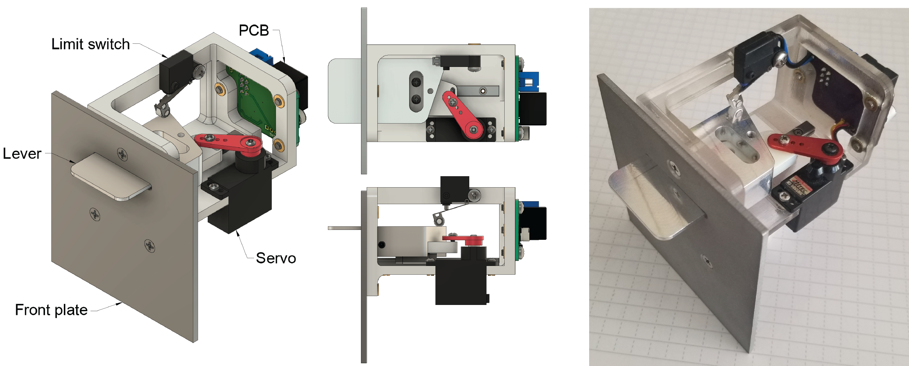
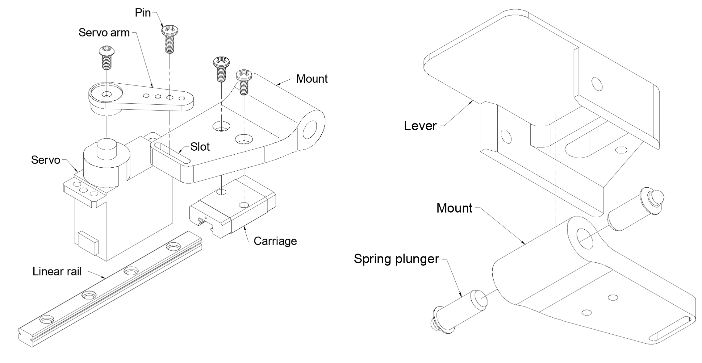
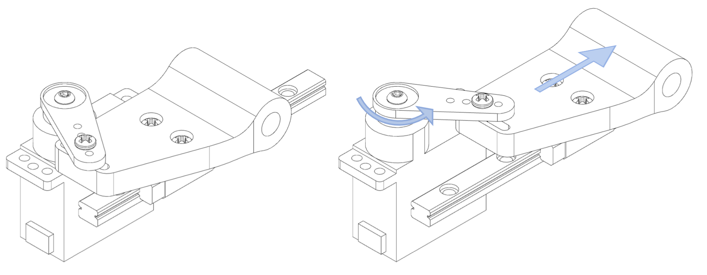
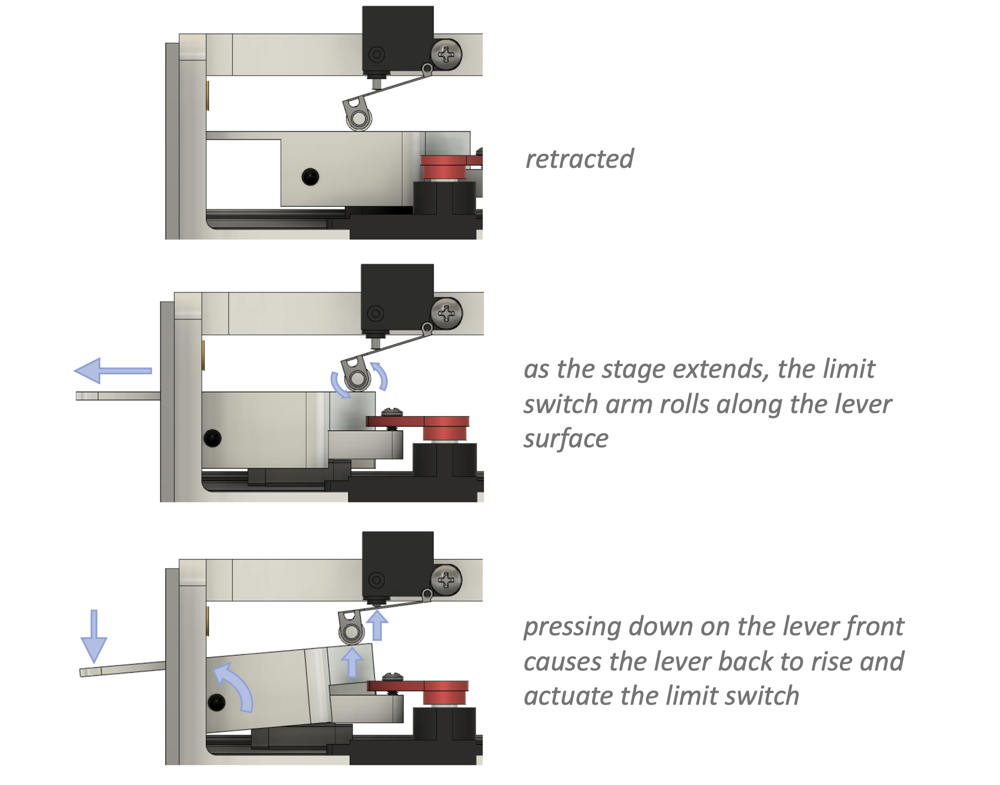

# Retractable Lever

This repository contains design files for a retractable lever used in behavioral neuroscience experiments.

Full documentation can be found at https://karpova-lab.github.io/lever/

Feedback and questions can be submitted to [discussions](https://github.com/Karpova-Lab/lever/discussions).

## License
This project is licensed under the [Janelia open-source hardware license](license_hardare.txt) and [Janelia 3-term BSD open-source software license](license_software.txt).

Please contact [innovation@janelia.hhmi.org](mailto:innovation@janelia.hhmi.org) if you have any questions about licensing or would like to use this project commercially.